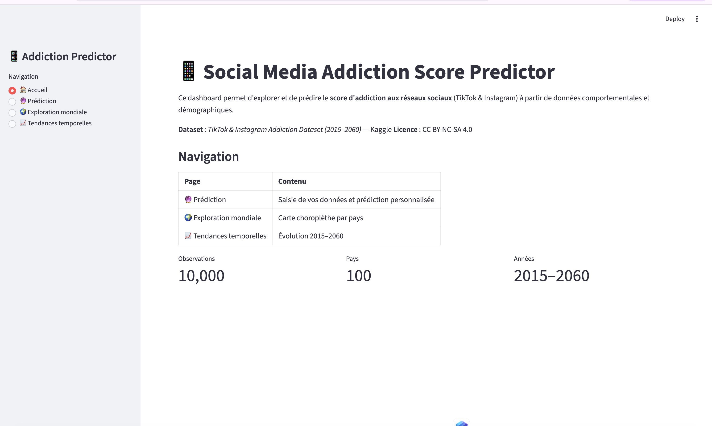
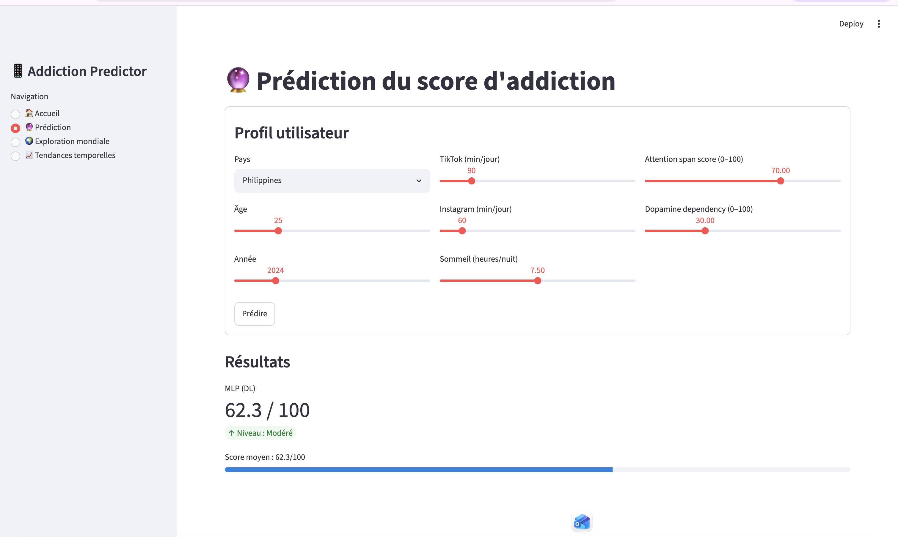
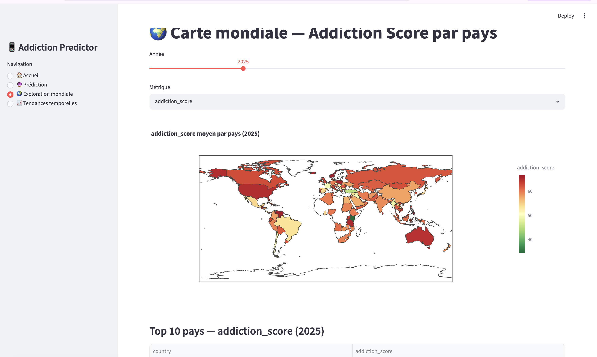
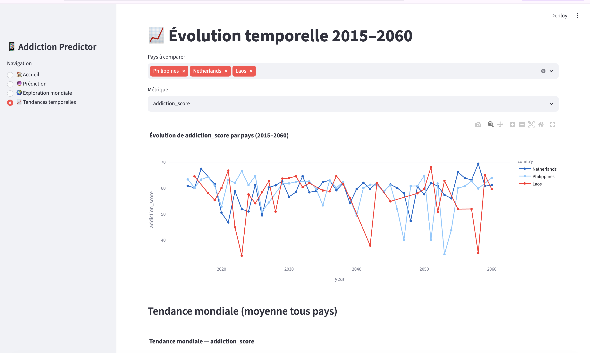

# Projet Deep Learning — Social Media Addiction Score Predictor

[](https://github.com/marcus-lntt/projet-dl-addiction/actions/workflows/ci.yml)

**Auteur** : Marcus LINGUET  
**Formation** : Deep Learning — APTI  
**Tâche** : Régression — prédire `addiction_score` (0–100) à partir de variables pays/année/usage réseaux sociaux.

Objectif du rendu : un projet **reproductible**, **testé**, et présenté comme un mini-produit data (code modulaire + notebooks + app Streamlit + CI).

## Problématique (le “pourquoi”)

**Question** : peut-on estimer un score d’addiction aux réseaux sociaux à partir d’indicateurs d’usage (TikTok/Instagram), de variables pays et d’une dimension temporelle (2015–2060) ?

**Enjeux** (dans un cadre data science) :
- comprendre quels signaux d’usage sont associés à un score plus élevé,
- fournir une estimation reproductible et comparable entre pays/années,
- tester des approches de complexité croissante sans “tricher” (anti-leakage).

**Approches comparées** :
- Baselines **ML** tabulaires (Ridge/Lasso/ElasticNet) : rapides, robustes, très compétitives.
- Baseline **DL** tabulaire (MLP PyTorch) : non-linéarités, capacité supérieure.
- Modélisation **séquentielle** (Transformer temporel) : exploite des historiques par pays pour capturer des dynamiques temporelles.

> Note : ce projet vise une **prédiction** (corrélation) et non une inférence causale.

## TL;DR (pour exécuter vite)

1) Télécharger les 3 CSV Kaggle (voir section Dataset) et les placer dans `data/`.

2) Installer / synchroniser l’environnement :

```bash
uv sync
```

3) Vérifier que le projet est sain :

```bash
uv run pytest -v
```

4) Lancer le dashboard :

```bash
uv run streamlit run app/streamlit_app.py
```

## Dashboard interactif (Jalon 9)

le projet inclut un **dashboard Streamlit interactif** dans `app/streamlit_app.py`.

### Pages disponibles
- **🏠 Accueil** : contexte dataset + indicateurs globaux (observations, pays, années)
- **🔮 Prédiction** : formulaire utilisateur (âge, minutes TikTok/Instagram, sommeil, etc.) + prédiction en direct
- **🌍 Exploration mondiale** : carte choroplèthe par pays et année
- **📈 Tendances temporelles** : courbes d’évolution (2015–2060) par pays + tendance mondiale

### Interactions clés
- sliders / sélecteurs (année, métrique, pays)
- comparaison de prédiction entre modèles (ML et DL)
- visualisations dynamiques Plotly (map, lignes, aire)

### Ce que démontre le dashboard
- capacité à **explorer** les données (spatial + temporel)
- capacité à **simuler** des profils et obtenir une prédiction instantanée
- capacité à **comparer** les approches ML/DL dans une interface unique

## Captures d’écran du dashboard

> Les captures ci-dessous sont attendues pour la correction visuelle du Jalon 9.

### 1) Vue générale (Accueil)


### 2) Page Prédiction (formulaire + résultat)


### 3) Exploration mondiale (carte)


### 4) Tendances temporelles (courbes)


## Dataset

Source : Kaggle — TikTok & Instagram Addiction Dataset (2015–2060) (CC BY-NC-SA 4.0)

À placer dans `data/` :

| Fichier | Lignes | Contenu |
|---|---:|---|
| `tiktok_instagram_global_100countries.csv` | 10 000 | Dataset principal — 100 pays, 2015–2060, 23 colonnes |
| `screen_time_behavior.csv` | 50 000 | Comportements screen time par plateforme, genre, âge |
| `country_wise_analysis_addiction.csv` | 100 | Agrégats par pays |

Le dataset n’est **pas versionné** (voir `.gitignore`). Lien : https://www.kaggle.com/datasets/abdulmaliklodhra/tiktok-and-instagram-addiction-dataset-20152060

## Données : qualité, préparation et limites

### Préparation appliquée
- chargement, nettoyage minimal et sélection de variables via `src/preprocessing.py`
- encodage des variables catégorielles + normalisation pour les modèles sensibles à l’échelle
- séparation train/test cohérente pour comparer ML et DL

### Points d’attention sur les données
- le dataset est de type **tabulaire synthétique/agrégé** (pas des traces individuelles brutes)
- la colonne `ASI` est fortement liée à la cible (`addiction_score`) et peut créer une fuite de données
- certaines relations apprises peuvent être corrélationnelles (pas causales)

### Limites
- généralisation réelle dépend de la qualité et de la représentativité des données source
- la dimension temporelle est utile, mais reste simplifiée par rapport à des séries réelles bruitées

### Note importante — Data leakage

La colonne `ASI` (Addiction Score Index) est exclue des features : elle encode directement la cible `addiction_score` (corrélation très élevée). Son exclusion rend la tâche réaliste et évite un faux score parfait.

## Difficultés rencontrées (et solutions)

- **Exécution notebooks / environnement** : configuration kernel + dépendances.  
	**Solution** : environnement verrouillé avec `uv`/`uv.lock`, exécution reproductible et CI.

- **Compatibilité PyTorch selon versions** (`ReduceLROnPlateau` et argument `verbose`).  
	**Solution** : correction de compatibilité dans le code d’entraînement (`src/models_dl.py`).

- **Risque de fuite de données** via `ASI`.  
	**Solution** : exclusion explicite de `ASI` des features + cohérence appli/notebooks/docs.

- **Comparaison équitable ML vs DL** : éviter des splits/métriques incohérents.  
	**Solution** : pipeline commun de préprocessing et évaluation standardisée.

## Cadre de réalisation

- Projet réalisé **individuellement (sans binôme)**.
- Assistance IA utilisée comme outil de pair-programming (voir section Transparence IA), avec relecture, compréhension et validation locale de tout le code.

## Architecture du projet

```
projet-dl-addiction/
├── .github/workflows/ci.yml       # CI GitHub Actions (uv sync + pytest)
├── app/streamlit_app.py           # Dashboard Streamlit
├── notebooks/                     # Notebooks (committés avec sorties exécutées)
├── src/                           # Code métier (importé dans notebooks/app)
├── tests/                         # Tests unitaires
├── pyproject.toml                 # Dépendances (uv)
├── uv.lock                        # Lockfile (reproductibilité)
└── requirements.txt               # Export pip (informatif)
```

Détails : voir `src/` et la doc livrables.

## Technologies utilisées

- **Packaging/Env** : `uv`, Python >= 3.10 (CI sur 3.11 ; dev local OK sur 3.12)
- **Data/ML** : pandas, NumPy, scikit-learn
- **Deep Learning** : PyTorch (MLP), optimisation Optuna
- **DL avancé** : Transformer temporel (attention multi-têtes, positional encoding)
- **App** : Streamlit + Plotly
- **Qualité** : pytest, CI GitHub Actions

## Installation & exécution (détaillé)

### 1) Prérequis : installer uv

```bash
curl -LsSf https://astral.sh/uv/install.sh | sh
```

### 2) Créer l’environnement

```bash
uv sync
```

### 3) Lancer les notebooks (dans l’ordre)

```bash
uv run jupyter notebook notebooks/
```

Ordre recommandé : `01_eda` → `02_ml_baseline` → `03_dl_fondamental` → `04_dl_avance`.

### 4) Lancer Streamlit

```bash
uv run streamlit run app/streamlit_app.py
```

### 5) Tests

```bash
uv run pytest tests/ -v
```

## CI/CD (ce qui est évaluable)

La CI est définie dans `.github/workflows/ci.yml` et exécute :

1) installation de `uv` + Python
2) `uv sync` (dépendances)
3) `pytest` + smoke imports

## Livrables & checklist de rendu

Pour une checklist “profs” (quoi montrer, quoi vérifier, commandes exactes, captures conseillées) :

- `docs/DELIVERABLES.md`

## Transparence IA

Ce projet a été développé avec assistance IA (pair programming) pour accélérer :

- la structuration modulaire (organisation `src/`, tests, app)
- certaines implémentations (boucles d’entraînement, transformer, CI)
- la relecture et l’amélioration de la documentation

Le code a été relu, compris et exécuté localement (notebooks + tests + app). Pour plus de détails : `docs/AI_TRANSPARENCY.md`.
